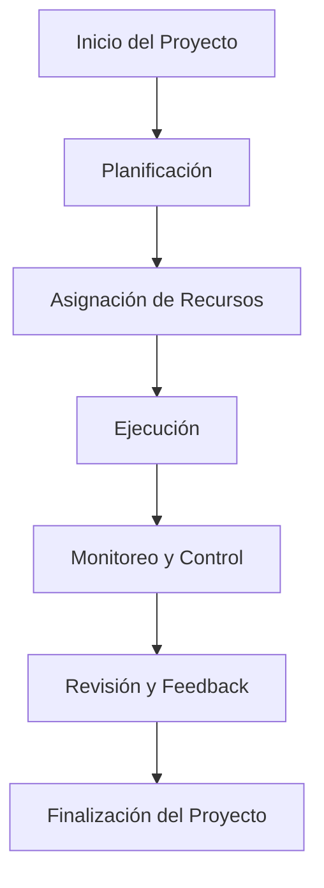

# **Manual Completo de GAIA²**
####  Global AI Assembled with Green Awareness and Integrated Accountability

---

## **Índice**

1. [Introducción](#1-introducción)
2. [Visión General de GAIA²](#2-visión-general-de-gaia²)
3. [Arquitectura de GAIA²](#3-arquitectura-de-gaia²)
   1. [Plataforma Central de Datos (DCP)](#31-plataforma-central-de-datos-dcp)
   2. [Módulo de Inteligencia Artificial y Aprendizaje Automático (IA/ML)](#32-módulo-de-inteligencia-artificial-y-aprendizaje-automático-iaml)
   3. [Blockchain y Contratos Inteligentes](#33-blockchain-y-contratos-inteligentes)
   4. [Metodología AMPEL](#34-metodología-ampel)
   5. [ChatQuantumBUS y Protocolo CQFAV1](#35-chatquantumbus-y-protocolo-cqfav1)
   6. [Infraestructura de Computación Cuántica (QC)](#36-infraestructura-de-computación-cuántica-qc)
   7. [Sistema de Internet de las Cosas (IoT)](#37-sistema-de-internet-de-las-cosas-iot)
   8. [Módulo de Seguridad y Protección de Datos (SPD)](#38-módulo-de-seguridad-y-protección-de-datos-spd)
   9. [Interfaz de Usuario y Experiencia (UI/UX)](#39-interfaz-de-usuario-y-experiencia-uiux)
   10. [Infraestructura de Red y Conectividad](#310-infraestructura-de-red-y-conectividad)
   11. [Módulo de Gestión de Proyectos y Tareas](#311-módulo-de-gestión-de-proyectos-y-tareas)
   12. [Módulo de Gestión de Recursos Humanos (HRM)](#312-módulo-de-gestión-de-recursos-humanos-hrm)
   13. [Módulo de Marketing y Ventas](#313-módulo-de-marketing-y-ventas)
   14. [Módulo de Soporte y Atención al Cliente](#314-módulo-de-soporte-y-atención-al-cliente)
   15. [Módulo de Reporting y Analítica](#315-módulo-de-reporting-y-analítica)
   16. [Módulo de Gestión de Innovación y Desarrollo (R&D)](#316-módulo-de-gestión-de-innovación-y-desarrollo-rd)
   17. [Módulo de Gestión de Integración con Terceros](#317-módulo-de-gestión-de-integración-con-terceros)
   18. [Módulo de Gestión de Contenidos (CMS)](#318-módulo-de-gestión-de-contenidos-cms)
   19. [Módulo de Logística y Gestión de Inventarios](#319-módulo-de-logística-y-gestión-de-inventarios)
4. [Aplicaciones y Casos de Uso](#4-aplicaciones-y-casos-de-uso)
5. [Seguridad y Cumplimiento](#5-seguridad-y-cumplimiento)
6. [Implementación y Despliegue](#6-implementación-y-despliegue)
7. [Gemelos Digitales y Simulaciones](#7-gemelos-digitales-y-simulaciones)
8. [Gestión de KPIs y Rendimiento](#8-gestión-de-kpis-y-rendimiento)
9. [Casos de Estudio y Ejemplos Prácticos](#9-casos-de-estudio-y-ejemplos-prácticos)
10. [Glosario y Abreviaturas](#10-glosario-y-abreviaturas)
11. [Preguntas Frecuentes (FAQ)](#11-preguntas-frecuentes-faq)
12. [Anexos](#12-anexos)
13. [Referencias](#13-referencias)
14. [Contacto](#14-contacto)
15. [Licencia y Derechos de Autor](#15-licencia-y-derechos-de-autor)

---

## **1. Introducción**

Bienvenido al **Manual Completo de GAIA²**, una guía exhaustiva diseñada para proporcionar un entendimiento profundo de nuestra plataforma integrada. GAIA² es una solución innovadora que combina tecnologías de vanguardia para optimizar procesos empresariales, impulsar la eficiencia y fomentar la transformación digital en su organización.

---

## **2. Visión General de GAIA²**

GAIA² es una plataforma multifuncional que integra Inteligencia Artificial, Blockchain, Computación Cuántica, IoT y otros módulos avanzados. Su arquitectura modular permite una adaptación flexible a las necesidades específicas de cada negocio, ofreciendo soluciones personalizadas y escalables.

---

## **3. Arquitectura de GAIA²**

La arquitectura de GAIA² está compuesta por diversos módulos interconectados que trabajan en sinergia para ofrecer un ecosistema robusto y eficiente.

### **Diagrama de Arquitectura Global de GAIA²**

```mermaid
graph TD
    subgraph DCP["Plataforma Central de Datos (DCP)"]
        A[Almacenamiento de Datos] --> B[Procesamiento de Datos]
        B --> C[Análisis y Reporting]
    end

    subgraph Modulos_Principales["Módulos Principales"]
        D[IA/ML] --> E[NLP]
        D --> F[Modelos Predictivos]
        G[Blockchain] --> H[Contratos Inteligentes]
        G --> I[Trazabilidad de Datos]
        J[ChatQuantumBUS] --> K[CQFAV1]
        L[IoT] --> M[Sensores y Actuadores]
    end

    subgraph SPD["Seguridad y Protección de Datos (SPD)"]
        N[Cifrado de Datos] --> O[Autenticación Multifactor]
        N --> P[Detección de Intrusiones]
    end

    subgraph UI_UX["Interfaz de Usuario (UI/UX)"]
        Q[Dashboard Interactivo] --> R[Panel de Control]
        Q --> S[Reportes Personalizados]
    end

    A --> D
    A --> G
    A --> J
    A --> L
    A --> N
    B --> D
    B --> G
    B --> J
    B --> L
    B --> N
    C --> Q
 ```

### **3.1. Plataforma Central de Datos (DCP)**

La **Plataforma Central de Datos (DCP)** es el núcleo de GAIA². Gestiona el almacenamiento, procesamiento y análisis de grandes volúmenes de datos, garantizando su integridad y disponibilidad en tiempo real. Utiliza sistemas de bases de datos distribuidas y tecnologías de Big Data para manejar información estructurada y no estructurada.

---

### **3.2. Módulo de Inteligencia Artificial y Aprendizaje Automático (IA/ML)**

El **Módulo de Inteligencia Artificial y Aprendizaje Automático (IA/ML)** incorpora algoritmos avanzados para proporcionar análisis predictivos, automatización de procesos y toma de decisiones informada. Ofrece capacidades como:

- **Procesamiento del Lenguaje Natural (NLP):** Permite a las máquinas entender y generar lenguaje humano.
- **Reconocimiento de patrones y anomalías:** Detecta tendencias y desviaciones en los datos.
- **Modelos de aprendizaje supervisado y no supervisado:** Facilita la creación de modelos predictivos y de clasificación.

---

### **3.3. Blockchain y Contratos Inteligentes**

La integración de **Blockchain** asegura transacciones transparentes y seguras. Los **Contratos Inteligentes** automatizan acuerdos y procesos, reduciendo errores y aumentando la eficiencia operativa. Esta tecnología descentralizada garantiza la inmutabilidad y trazabilidad de las operaciones.

---

### **3.4. Metodología AMPEL**

La **Metodología AMPEL** (Análisis, Modelado, Prueba, Ejecución y Loop) es un enfoque iterativo para el desarrollo y mejora continua de sistemas y procesos dentro de GAIA². Facilita la adaptación rápida a cambios y la optimización constante mediante ciclos de retroalimentación.

---

### **3.5. ChatQuantumBUS y Protocolo CQFAV1**

El **ChatQuantumBUS** es un sistema de comunicación avanzada que utiliza el **Protocolo CQFAV1**. Este protocolo combina técnicas de computación cuántica para ofrecer comunicaciones ultrarrápidas y seguras entre los diferentes módulos y usuarios, asegurando baja latencia y alta resistencia a interferencias.

---

### **3.6. Infraestructura de Computación Cuántica (QC)**

La **Infraestructura de Computación Cuántica (QC)** permite a GAIA² resolver problemas complejos y procesar grandes cantidades de datos a velocidades sin precedentes, superando las limitaciones de la computación clásica. Esta tecnología es especialmente útil en áreas como optimización, criptografía y modelado molecular.

---

### **3.7. Sistema de Internet de las Cosas (IoT)**

El **Sistema de Internet de las Cosas (IoT)** conecta dispositivos y sensores, facilitando la recopilación y análisis de datos en tiempo real. Permite la monitorización y control remotos, mejorando la eficiencia y reduciendo costos operativos. Es compatible con múltiples protocolos y estándares de comunicación.

---

### **3.8. Módulo de Seguridad y Protección de Datos (SPD)**

El **Módulo de Seguridad y Protección de Datos (SPD)** garantiza la confidencialidad, integridad y disponibilidad de la información. Implementa protocolos de seguridad avanzados, como cifrado de extremo a extremo y autenticación multifactor, y cumple con las regulaciones internacionales de protección de datos.

---

### **3.9. Interfaz de Usuario y Experiencia (UI/UX)**

GAIA² ofrece una **Interfaz de Usuario (UI)** intuitiva y personalizable que mejora la **Experiencia del Usuario (UX)**. Facilita la navegación y acceso a las funcionalidades de la plataforma, adaptándose a las necesidades y preferencias de cada usuario.

---

### **3.10. Infraestructura de Red y Conectividad**

La **Infraestructura de Red y Conectividad** asegura conexiones estables y seguras entre todos los componentes de GAIA². Utiliza tecnologías de red de alta velocidad y protocolos de comunicación eficientes para garantizar baja latencia y alta disponibilidad.

#### **Diagrama de Red de GAIA²**

```mermaid
graph LR
    subgraph Data_Centers
        DC1[Data Center 1] --> SW1[Switch Principal]
        DC2[Data Center 2] --> SW2[Switch Principal]
    end

    subgraph Red_Interna
        SW1 --> Server1[Servidor IA/ML]
        SW1 --> Server2[Servidor Blockchain]
        SW2 --> Server3[Servidor IoT]
        SW2 --> Server4[Servidor ChatQuantumBUS]
    end

    subgraph Dispositivos_IoT
        IoT1[Sensores Ambientales] --> Server3
        IoT2[Drones] --> Server3
    end

    subgraph Usuarios
        User1[Empleado] --> SW1
        User2[Administrador] --> SW2
    end

    subgraph Seguridad
        Firewall1[Firewall] --> SW1
        Firewall2[Firewall] --> SW2
    end

    subgraph Conexiones_Externas
        Internet --> Firewall1
        Internet --> Firewall2
        API[APIs de Terceros] --> Server4
    end
```

---

### **3.11. Módulo de Gestión de Proyectos y Tareas**

El **Módulo de Gestión de Proyectos y Tareas** permite la planificación, seguimiento y gestión eficiente de proyectos y tareas. Ofrece herramientas para:

- **Asignación de recursos:** Optimiza el uso de recursos humanos y materiales.
- **Establecimiento de plazos:** Define y monitorea hitos y fechas límite.
- **Colaboración en equipo:** Facilita la comunicación y coordinación entre miembros del equipo.

#### **Flujo de Gestión de Proyectos**



---

### **3.12. Módulo de Gestión de Recursos Humanos (HRM)**

El **Módulo de Gestión de Recursos Humanos (HRM)** optimiza procesos de recursos humanos, incluyendo:

- **Reclutamiento y selección:** Automatiza la publicación de vacantes y filtrado de candidatos.
- **Capacitación y desarrollo:** Gestiona programas de formación y seguimiento de competencias.
- **Evaluación del desempeño:** Proporciona herramientas para feedback y revisión de objetivos.
- **Gestión de nóminas:** Automatiza cálculos salariales y cumplimiento fiscal.

---

### **3.13. Módulo de Marketing y Ventas**

El **Módulo de Marketing y Ventas** facilita la creación y ejecución de estrategias de marketing, gestión de relaciones con clientes y análisis de rendimiento de ventas. Incluye funcionalidades para:

- **Automatización de marketing:** Gestiona campañas multicanal y segmentación de audiencias.
- **Gestión de clientes (CRM):** Centraliza información de clientes y seguimiento de interacciones.
- **Análisis de ventas:** Proporciona informes sobre rendimiento de productos y pronósticos.

---

### **3.14. Módulo de Soporte y Atención al Cliente**

El **Módulo de Soporte y Atención al Cliente** proporciona herramientas para gestionar eficientemente las consultas y solicitudes de los clientes, mejorando la satisfacción y fidelización. Ofrece:

- **Sistema de tickets:** Rastrea y prioriza incidencias.
- **Base de conocimientos:** Facilita el autoservicio mediante FAQs y guías.
- **Chat en vivo y chatbots:** Brinda soporte inmediato y automatizado.

---

### **3.15. Módulo de Reporting y Analítica**

El **Módulo de Reporting y Analítica** genera informes detallados y análisis de datos que apoyan la toma de decisiones estratégicas. Permite la visualización personalizada de métricas clave mediante:

- **Paneles de control interactivos:** Monitorea KPIs en tiempo real.
- **Análisis predictivo:** Anticipa tendencias y comportamientos futuros.
- **Integración con otras fuentes de datos:** Combina información interna y externa.

---

### **3.16. Módulo de Gestión de Innovación y Desarrollo (R&D)**

El **Módulo de Gestión de Innovación y Desarrollo (R&D)** fomenta la innovación al gestionar proyectos de investigación y desarrollo, facilitando la colaboración y seguimiento de avances tecnológicos. Incluye:

- **Gestión de ideas:** Captura y evalúa propuestas innovadoras.
- **Planificación de proyectos R&D:** Coordina recursos y plazos específicos.
- **Colaboración interdisciplinaria:** Conecta equipos de diferentes áreas.

---

### **3.17. Módulo de Gestión de Integración con Terceros**

El **Módulo de Gestión de Integración con Terceros** asegura una integración fluida con aplicaciones y servicios externos a través de APIs y estándares abiertos, ampliando las capacidades de GAIA². Facilita:

- **Conexión con sistemas ERP, CRM y más:** Sincroniza datos y procesos.
- **Gestión de API:** Controla acceso y uso de interfaces de programación.
- **Adaptadores y conectores personalizados:** Soporta integraciones específicas.

---

### **3.18. Módulo de Gestión de Contenidos (CMS)**

El **Módulo de Gestión de Contenidos (CMS)** permite crear, editar y publicar contenidos digitales de manera eficiente. Soporta múltiples formatos y canales de distribución, ofreciendo:

- **Editor de contenidos intuitivo:** Facilita la creación de páginas y artículos.
- **Gestión multimedia:** Administra imágenes, videos y otros recursos.
- **Publicación multicanal:** Distribuye contenido en web, móvil y redes sociales.

---

### **3.19. Módulo de Logística y Gestión de Inventarios**

El **Módulo de Logística y Gestión de Inventarios** optimiza la cadena de suministro y gestión de inventarios, mejorando la eficiencia operativa y reduciendo costos asociados. Proporciona:

- **Seguimiento en tiempo real:** Monitorea niveles de inventario y movimiento de mercancías.
- **Optimización de rutas:** Planifica entregas y recogidas de forma eficiente.
- **Gestión de proveedores y pedidos:** Coordina compras y relaciones con proveedores.

---

## **4. Aplicaciones y Casos de Uso**

GAIA² es aplicable en diversos sectores, adaptándose a las necesidades específicas de cada industria. Algunos ejemplos incluyen:

### **Tabla Comparativa de Aplicaciones por Sector**

| Sector       | Aplicaciones                            | Beneficios Clave                           |
|--------------|-----------------------------------------|--------------------------------------------|
| **Manufactura** | - Automatización de producción<br>- Mantenimiento predictivo | - Reducción de costos<br>- Mejora en calidad |
| **Salud**       | - Gestión de registros médicos<br>- Diagnósticos predictivos | - Eficiencia operativa<br>- Atención personalizada |
| **Finanzas**    | - Detección de fraudes<br>- Gestión de riesgos | - Seguridad mejorada<br>- Cumplimiento regulatorio |

---

## **5. Seguridad y Cumplimiento**

GAIA² cumple con estándares y regulaciones internacionales, asegurando un alto nivel de seguridad y cumplimiento legal:

- **Protección de datos personales:** Cumplimiento con GDPR, HIPAA y otras regulaciones.
- **Cifrado de datos:** Implementación de cifrado en tránsito y en reposo.
- **Auditorías y certificaciones:** Mantenimiento de certificaciones como ISO 27001.

---

## **6. Implementación y Despliegue**

Para una implementación exitosa de GAIA², se deben considerar los siguientes aspectos:

- **Requisitos de hardware y software:** Especificaciones técnicas necesarias para el correcto funcionamiento.
- **Configuración inicial:** Guía paso a paso para la instalación y puesta en marcha.
- **Pruebas de funcionamiento:** Procedimientos para validar la correcta integración y desempeño del sistema.

---

## **7. Gemelos Digitales y Simulaciones**

GAIA² utiliza **Gemelos Digitales** para crear réplicas virtuales de sistemas físicos, permitiendo:

- **Simulaciones:** Pruebas de escenarios sin afectar las operaciones reales.
- **Optimización de procesos:** Identificación de áreas de mejora mediante análisis virtuales.
- **Reducción de riesgos:** Anticipación de posibles fallos y planificación de contingencias.

---

## **8. Gestión de KPIs y Rendimiento**

La plataforma permite definir y monitorear **Indicadores Clave de Rendimiento (KPIs)** para evaluar la eficiencia y efectividad de procesos y proyectos:

- **Personalización de KPIs:** Adaptación a objetivos específicos de la organización.
- **Alertas y notificaciones:** Avisos automáticos ante desviaciones o cumplimientos.
- **Análisis histórico:** Seguimiento de tendencias a lo largo del tiempo.

---

## **9. Casos de Estudio y Ejemplos Prácticos**

### **Caso de Estudio: Empresa A (Sector Manufactura)**

**Desafío:** Tiempos de producción elevados y altos costos operativos.

**Solución Implementada:**

- Integración de GAIA² con módulos de IA/ML para automatización de líneas de producción.
- Implementación de mantenimiento predictivo utilizando análisis de datos de sensores.

**Resultados:**

- **Reducción de tiempos de producción:** 30% menos tiempo gracias a la automatización.
- **Ahorro en costos operativos:** 20% de reducción mediante mantenimiento predictivo.
- **Mejora en la calidad del producto:** Disminución de defectos en un 15%.

---

## **10. Glosario y Abreviaturas**

[Aquí se incluye el glosario actualizado con todas las abreviaturas y términos técnicos utilizados en el manual.]

---

## **11. Preguntas Frecuentes (FAQ)**

### **¿Qué es ChatQuantumBUS y cómo mejora la comunicación en GAIA²?**

ChatQuantumBUS es una arquitectura de bus de comunicación avanzada que permite la transferencia de datos en tiempo real entre diferentes módulos y componentes de GAIA². Utiliza el **Protocolo CQFAV1**, que combina técnicas de computación cuántica para ofrecer comunicaciones ultrarrápidas y seguras, reduciendo la latencia y aumentando la resiliencia frente a interferencias.

### **¿Cómo garantiza GAIA² la seguridad de los datos?**

GAIA² implementa múltiples capas de seguridad, incluyendo cifrado de extremo a extremo, autenticación multifactor, firewalls avanzados y cumplimiento con regulaciones internacionales como GDPR e ISO 27001. Además, el **Módulo de Seguridad y Protección de Datos (SPD)** monitorea continuamente las amenazas y gestiona la protección de la información.

### **¿Es posible integrar GAIA² con sistemas existentes en mi organización?**

Sí, el **Módulo de Gestión de Integración con Terceros** permite una integración fluida con aplicaciones y servicios externos a través de APIs y estándares abiertos, facilitando la interoperabilidad con sistemas existentes como ERP, CRM y otros.

---

## **12. Anexos**

- **Especificaciones técnicas detalladas de cada módulo.**
- **Guías de usuario avanzadas.**
- **Protocolos y estándares utilizados.**
- **Mockups y prototipos de la interfaz de usuario (UI/UX).**

---

## **13. Referencias**

- Artículos académicos sobre IA y Computación Cuántica.
- Documentación oficial de estándares como GDPR y ISO 27001.
- Publicaciones especializadas en tecnologías Blockchain y IoT.

---

## **14. Contacto**

Para soporte técnico, consultas o colaboración, puede contactarnos a través de:

- **Correo electrónico:** amedeo.pelliccia@gmail.com
---

## **15. Licencia y Derechos de Autor**

Este manual y la plataforma GAIA² están protegidos por derechos de autor y están sujetos a los términos y condiciones establecidos en el acuerdo de licencia. Está prohibida la reproducción total o parcial sin autorización expresa.

**Derechos de Autor © 2024 GAIA². Todos los derechos reservados.**

---

*Nota: La información proporcionada en este manual es general y puede variar según las configuraciones y personalizaciones específicas de cada implementación de GAIA². Para información detallada y actualizada, consulte con el equipo de soporte o su representante de cuenta.*

---

[Volver al inicio](#manual-completo-de-gaia²)

---

*Última actualización: Octubre de 2024*

---

**Fin del documento**

---

## **Recursos y Herramientas Recomendadas**

### **Herramientas para Creación de Diagramas y Visualizaciones**

- **Mermaid:** Para crear diagramas simples directamente en Markdown.
- **Figma:** Herramienta de diseño colaborativo para crear prototipos interactivos.
- **Draw.io (diagrams.net):** Plataforma gratuita para crear una amplia variedad de diagramas.
- **Lucidchart:** Herramienta basada en la nube para diagramas colaborativos.

### **Integración con Plataformas de BI**

- **Power BI:** Para crear dashboards interactivos y análisis de datos avanzados.
- **Tableau:** Herramienta potente para visualización de datos y creación de informes interactivos.

---

## **Próximos Pasos y Expansiones Futuras**

- **Desarrollo de Casos de Estudio Adicionales:** Expandir los casos de uso en sectores como Energía, Agricultura y Educación.
- **Optimización de Contenido y Formato:** Incorporar más elementos visuales como gráficos y tablas comparativas.
- **Actualización Continua:** Implementar un proceso de revisión periódica para mantener la documentación actualizada con los avances tecnológicos y las necesidades de los usuarios.

---

¡Gracias por su interés en GAIA²! Esperamos que este manual le sea de gran utilidad. Si tiene más sugerencias o necesita información adicional, no dude en contactarnos.
